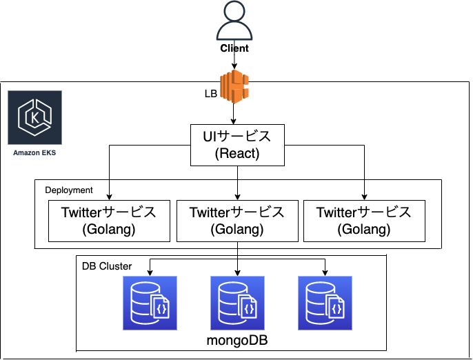

# 概要
マイクロサービス、Kubernetes技術検証用TwitterデモアプリのUIサービス

# 使用技術
## バックエンド
- Golang

## フロントエンド
- React

## 開発環境、インフラ
- AWS
- EKS
- Kubernetes
- Docker/Docker-compose
- MongoDB
- Nginx

## 認証
- JWT認証

# 機能一覧/詳細
## ユーザ機能
- 新規登録、ログイン、ログアウト、ユーザ情報編集
- ユーザ検索機能
- ユーザ一覧表示

## ツイート機能
- ツイート投稿、ツイート表示、ツイート削除
- フォロー、アウンフォロー
- フォローツイート表示
- フォロワー表示

# インフラ構成
 

